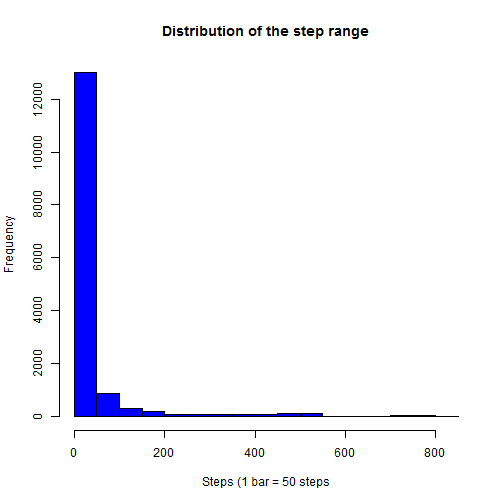
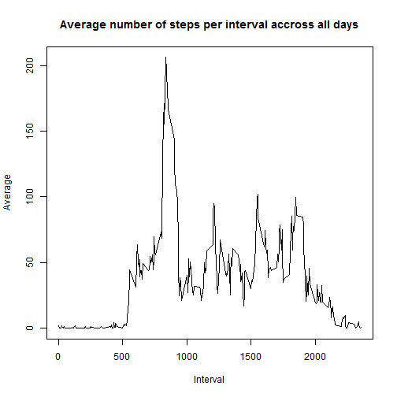
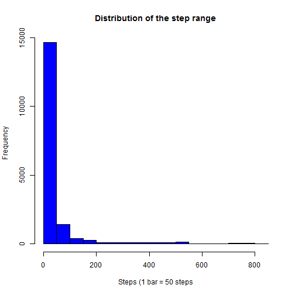

Reproducible Resarch 1st Assessment


## Loading and preprocessing the data

Let's start by loading the file and transforming the dates into actual date types.
The locale is set on default (english) in order to make sure everybody understands the labels.

```r
Sys.setlocale(category="LC_TIME", locale="C")
```

```
## [1] "C"
```

```r
#dplyr is used for ease of data manipulation
library(dplyr)
library(lattice)

activity_data <- read.csv(file ="activity.csv", header = TRUE)

#The date column is transformed from Factor to date
activity_data$date <- as.Date(activity_data$date)
activity_data$day <- weekdays(activity_data$date)
```

## What is mean total number of steps taken per day?

The total number of steps per day is given by the following code:

```r
count_per_day <- group_by(activity_data, day)
summarize(count_per_day,sum(steps, na.rm=TRUE))
```

```
## Source: local data frame [7 x 2]
## 
##         day sum(steps, na.rm = TRUE)
##       (chr)                    (int)
## 1    Friday                    86518
## 2    Monday                    69824
## 3  Saturday                    87748
## 4    Sunday                    85944
## 5  Thursday                    65702
## 6   Tuesday                    80546
## 7 Wednesday                    94326
```

The next step is to create a histogram showing the pattern around the number of steps:

```r
hist(activity_data$steps, main="Distribution of the step range", xlab="Steps (1 bar = 50 steps", col="blue")
```

 

Now, we calculate the mean of the number of steps per day:

```r
mean_basis <- summarize(count_per_day, steps = sum(steps, na.rm=TRUE))
mean(mean_basis$steps)
```

```
## [1] 81515.43
```

Finally, we calculate the median of the same variable:

```r
median(mean_basis$steps)
```

```
## [1] 85944
```

## What is the average daily activity pattern?

The first step is to make a time series showing the pattern for each time interval accross all days:

```r
#data preparation before creation of the graph
average_per_interval <- group_by(activity_data, interval)
average <- summarize(average_per_interval, average=mean(steps, na.rm=TRUE))

plot(average$interval,average$average, type="l", main="Average number of steps per interval accross all days", xlab="Interval", ylab="Average")
```

 

Now we need to use the preparatory data in order to find the interval with the biggest average value:

```r
max_interval <- max(average$average)
filter(average, average == max_interval)
```

```
## Source: local data frame [1 x 2]
## 
##   interval  average
##      (int)    (dbl)
## 1      835 206.1698
```

## Imputing missing values

First of all, we need to count the number of missing step values in our dataset:

```r
sum(is.na(activity_data$steps))
```

```
## [1] 2304
```

Now, we are going to create a new dataset and replace those missing values by the interval mean in the new dataset:

```r
complete_activity <- activity_data

complete_activity$steps[is.na(complete_activity$steps)] <-     ave(complete_activity$steps,complete_activity$interval,FUN=function(x)mean(x,na.rm = T))[is.na(complete_activity$steps)]
```

Now, we are going to create a histogram showing the pattern around the number of steps:

```r
count_per_day2 <- group_by(complete_activity, day)
summarize(count_per_day2,sum(steps, na.rm=TRUE))
```

```
## Source: local data frame [7 x 2]
## 
##         day sum(steps, na.rm = TRUE)
##       (chr)                    (dbl)
## 1    Friday                108050.38
## 2    Monday                 91356.38
## 3  Saturday                 98514.19
## 4    Sunday                 96710.19
## 5  Thursday                 76468.19
## 6   Tuesday                 80546.00
## 7 Wednesday                105092.19
```

```r
hist(complete_activity$steps, main="Distribution of the step range", xlab="Steps (1 bar = 50 steps", col="blue")
```

 

Now, we calculate the mean of the number of steps per day:

```r
mean_basis2 <- summarize(count_per_day2, steps = sum(steps, na.rm=TRUE))
mean(mean_basis2$steps)
```

```
## [1] 93819.64
```
to compare to the value at question 1:

```r
mean(mean_basis$steps)
```

```
## [1] 81515.43
```

Finally, we calculate the median of the same variable:

```r
median(mean_basis2$steps)
```

```
## [1] 96710.19
```
to compare to the value at question 1:

```r
median(mean_basis$steps)
```

```
## [1] 85944
```

The result is that both the mean and median values have gone up by more than 10k steps on average.

## Are there differences in activity patterns between weekdays and weekends?

The first step to answer this question is to create a new variable in the dataset which we can use to distinguish weekdays and weekends:

```r
#first we add a new column called weekday
activity_data$weekday <- "Weekday"
activity_data$weekday[activity_data$day == "Saturday"] <- "Weekend"
activity_data$weekday[activity_data$day == "Sunday"] <- "Weekend"
activity_data$weekday <- as.factor(activity_data$weekday)

#we then recalculate a group by by weekday and interval
final_groupby = group_by(activity_data, weekday, interval)
final_graph <- summarize(final_groupby, average=mean(steps, na.rm=TRUE))
```

This variable displays "Weekday" for days between monday and friday included, and "Weekend" for saturdays and sundays.

Now we are going to plot 2 graphs, one for weekdays, the other one for weekends, in order to be able to get a visual comparison:

```r
xyplot(final_graph$average ~ final_graph$interval | final_graph$weekday, type="l", layout=c(1,2), xlab="Interval", ylab="Number of steps")
```

 
